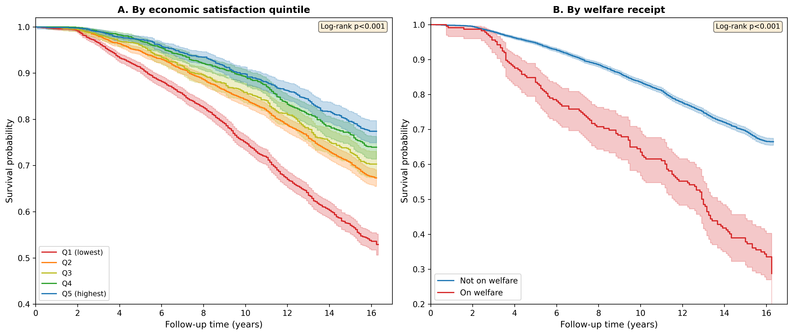
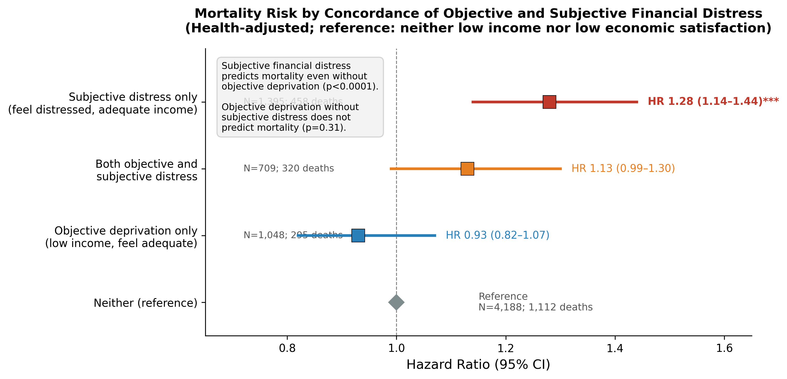
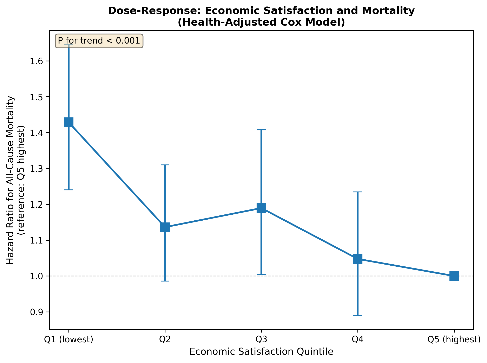
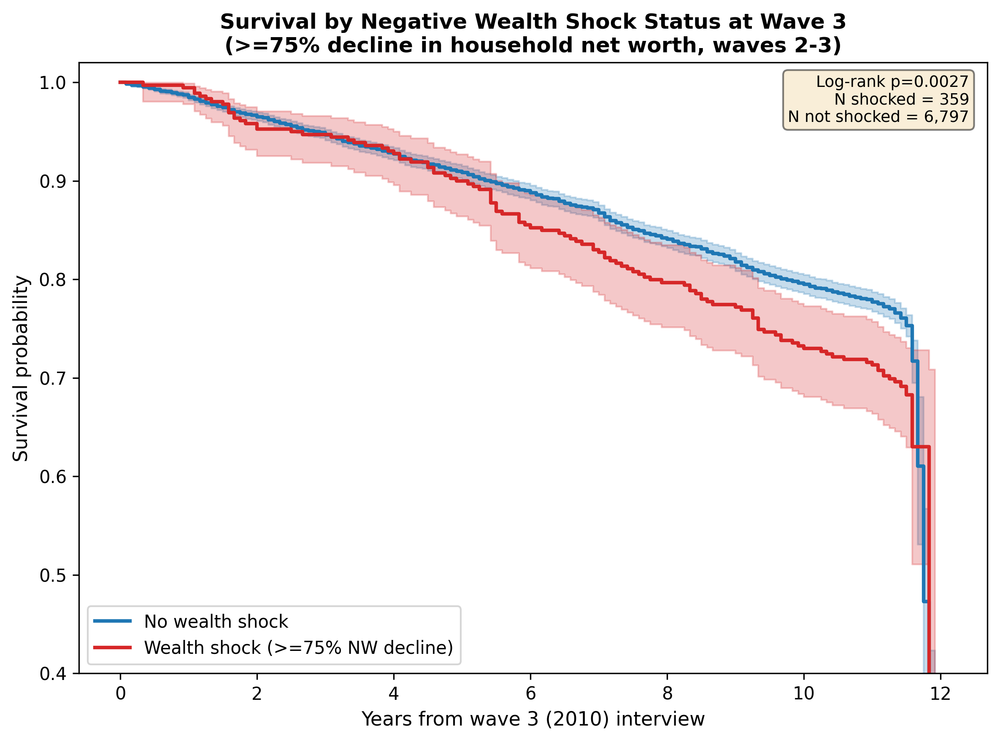
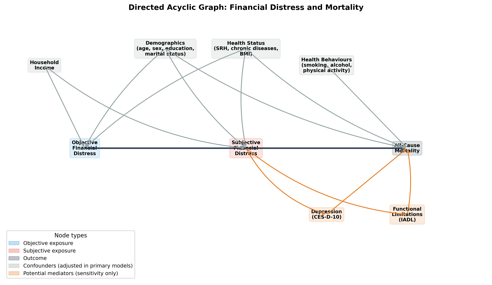
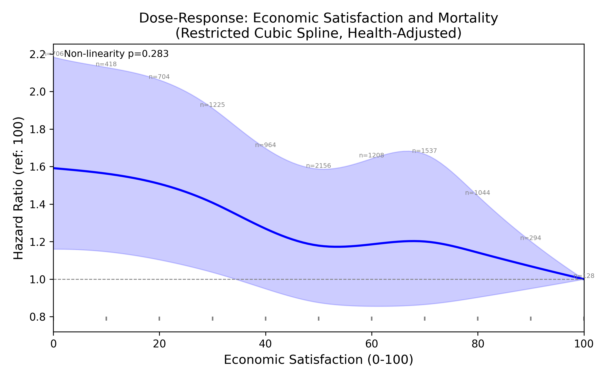

# Tables and Figures

## Economic insecurity and mortality in later life: a 16-year national cohort study from South Korea

---

\newpage

## Table 1. Baseline characteristics by economic satisfaction status (N=10,384)

| Characteristic | Overall (N=10,384) | Low econ sat (Q1) (N=3,053) | Higher econ sat (Q2--Q5) (N=7,331) | P |
|:---|:---:|:---:|:---:|:---:|
| Age, years, mean (SD) | 61.0 (10.8) | 64.0 (11.2) | 59.7 (10.5) | <0.001 |
| Female, % | 56.4 | 61.0 | 54.4 | <0.001 |
| Married, % | 78.9 | 66.8 | 84.0 | <0.001 |
| **Education, %** | | | | <0.001 |
|   No formal/elementary | 43.9 | 61.9 | 36.5 | |
|   Middle school | 15.5 | 14.0 | 16.1 | |
|   High school | 28.7 | 19.0 | 32.7 | |
|   College or higher | 11.8 | 5.0 | 14.7 | |
| Self-rated health (1--5), mean (SD) | 3.6 (1.0) | 4.1 (1.0) | 3.4 (1.0) | <0.001 |
| Chronic diseases, mean (SD) | 0.7 (0.9) | 1.0 (1.1) | 0.6 (0.9) | <0.001 |
| Hypertension, % | 26.2 | 32.6 | 23.6 | <0.001 |
| Diabetes, % | 11.3 | 15.2 | 9.7 | <0.001 |
| Cancer, % | 2.3 | 3.1 | 1.9 | <0.001 |
| Heart disease, % | 4.5 | 6.8 | 3.5 | <0.001 |
| Cerebrovascular disease, % | 3.1 | 5.0 | 2.2 | <0.001 |
| BMI, kg/m^2^, mean (SD) | 23.2 (2.8) | 23.1 (3.0) | 23.2 (2.7) | <0.001 |
| Current smoker, % | 18.8 | 20.9 | 17.9 | <0.001 |
| Depression (CES-D), % | 11.8 | 21.4 | 7.4 | <0.001 |
| IADL limitations, mean (SD) | 0.5 (1.7) | 0.9 (2.3) | 0.3 (1.3) | <0.001 |
| Econ satisfaction (0--100), mean (SD) | 48.6 (24.2) | 18.0 (11.9) | 61.3 (14.9) | <0.001 |
| HH income (10K won), mean (SD) | 2223.7 (2802.1) | 1143.6 (1527.1) | 2657.1 (3067.8) | <0.001 |
| Welfare recipient (NBLSS), % | 2.2 | 6.2 | 0.5 | <0.001 |
| National Pension recipient, % | 8.7 | 9.6 | 8.4 | 0.043 |
| | | | | |
| Follow-up years, mean (SD) | 12.5 (4.5) | 12.0 (4.7) | 12.7 (4.5) | |
| Deaths, n (%) | 3,074 (29.6) | 1,290 (42.3) | 1,784 (24.3) | <0.001 |

*Low economic satisfaction defined as bottom quintile of baseline distribution (scores <=30, four lowest categories on the 11-point scale). Self-rated health: 1=excellent, 5=very poor. IADL: instrumental activities of daily living.*

\newpage

## Table 2. Association of financial distress measures with all-cause mortality

### Panel A: Separate models -- Subjective measures

| Exposure | Unadjusted | Demographic | Health-adjusted | Mediator-adjusted |
|:---|:---:|:---:|:---:|:---:|
| Low econ sat (Q1) | 1.87 (1.74--2.01) | 1.44 (1.34--1.55) | 1.27 (1.17--1.39) | 1.23 (1.13--1.35) |
| Per 10-pt decrease | 1.16 (1.14--1.17) | 1.08 (1.07--1.10) | 1.05 (1.03--1.07) | 1.05 (1.03--1.07) |

### Panel B: Separate models -- Objective measures

| Exposure | Unadjusted | Demographic | Health-adjusted | Mediator-adjusted |
|:---|:---:|:---:|:---:|:---:|
| Low HH income | 1.59 (1.46--1.74) | 1.01 (0.92--1.10) | 0.94 (0.85--1.03) | 0.95 (0.86--1.04) |
| Welfare receipt (NBLSS) | 2.66 (2.24--3.16) | 1.31 (1.10--1.56) | 1.23 (1.01--1.51) | 1.21 (0.98--1.48) |
| Low personal net assets | 0.87 (0.77--0.98) | 0.99 (0.88--1.12) | 0.96 (0.83--1.09) | 0.95 (0.83--1.09) |

### Panel C: Combined model (all objective + subjective, health-adjusted)

| Exposure | HR (95% CI) | P |
|:---|:---:|:---:|
| Low econ sat (Q1) | **1.30 (1.14--1.48)** | **<0.001** |
| Low HH income | 0.91 (0.80--1.03) | 0.13 |
| Welfare receipt (NBLSS) | 1.21 (0.92--1.60) | 0.18 |
| Low personal net assets | 0.97 (0.83--1.12) | 0.65 |

*N=5,010; 1,195 events. Panel C adjusted for age, sex, education, marital status, self-rated health, chronic diseases, BMI, smoking, drinking, exercise. Panels A--B: health-adjusted models additionally adjusted for drinking and exercise; mediator-adjusted models add continuous CES-D-10 and IADL.*

### Panel D: Continuous combined model (health-adjusted)

| Exposure | HR (95% CI) | P |
|:---|:---:|:---:|
| Econ dissatisfaction (per 10-pt decrease) | **1.050 (1.029--1.072)** | **<0.0001** |
| Log HH income (per unit) | 1.022 (0.988--1.057) | 0.20 |

\newpage

## Figure 1. Kaplan--Meier survival curves by economic satisfaction quintile

{width=100%}

\newpage

## Figure 2. Discordance analysis: hazard ratios by agreement/disagreement between objective and subjective financial distress

{width=100%}

*Health-adjusted model. Reference group: neither low income nor low satisfaction (N=4,199). Both: HR=1.14 (1.00--1.31); Subjective only: HR=1.28 (1.14--1.44); Objective only: HR=0.93 (0.82--1.06).*

\newpage

## Table 3. Time-varying Cox models

### Panel A: Low economic satisfaction (fixed threshold <=30, time-varying)

| Model | Person-intervals | Events | HR (95% CI) | P |
|:---|:---:|:---:|:---:|:---:|
| Unadjusted | 63,132 | 3,067 | 2.14 (2.00--2.30) | <0.001 |
| + Demographics | 63,132 | 3,067 | 1.63 (1.51--1.75) | <0.001 |
| + Health | 61,689 | 2,883 | 1.35 (1.26--1.46) | <0.001 |
| Fully adjusted | 59,929 | 2,856 | 1.22 (1.13--1.32) | <0.001 |

### Panel B: Per 10-point decrease in economic satisfaction (time-varying)

| Model | Person-intervals | Events | HR (95% CI) | P |
|:---|:---:|:---:|:---:|:---:|
| Fully adjusted | 59,929 | 2,856 | 1.06 (1.04--1.08) | <0.001 |

### Panel C: Household wealth shock, current wave (time-varying)

| Model | Person-intervals | Events | HR (95% CI) | P |
|:---|:---:|:---:|:---:|:---:|
| Unadjusted | 40,274 | 1,942 | 1.14 (0.92--1.40) | 0.231 |
| + Demographics | 40,274 | 1,942 | 1.02 (0.82--1.26) | 0.879 |
| + Health | 39,503 | 1,834 | 0.97 (0.78--1.20) | 0.773 |
| Fully adjusted | 38,672 | 1,817 | 0.97 (0.78--1.20) | 0.773 |

### Panel D: Cumulative household wealth shock (ever shocked, time-varying)

| Model | Person-intervals | Events | HR (95% CI) | P |
|:---|:---:|:---:|:---:|:---:|
| Unadjusted | 40,274 | 1,942 | 1.19 (1.05--1.35) | 0.007 |
| + Demographics | 40,274 | 1,942 | 1.10 (0.97--1.25) | 0.141 |
| + Health | 39,503 | 1,834 | 1.01 (0.89--1.15) | 0.848 |
| Fully adjusted | 38,672 | 1,817 | 1.03 (0.91--1.17) | 0.604 |

### Panel E: Combined time-varying model (all measures jointly)

| Exposure | HR (95% CI) | P |
|:---|:---:|:---:|
| Low econ sat (time-varying) | 1.09 (0.99--1.20) | 0.09 |
| Low HH income (time-varying) | **1.10 (1.00--1.21)** | **0.04** |
| HH wealth shock (time-varying) | 0.97 (0.78--1.20) | 0.77 |

*N=38,556 person-intervals; 1,806 events. Fully adjusted for age, sex, education, marital status, self-rated health, chronic diseases, BMI, smoking, depression, and IADL.*

---

\newpage

# Supplementary Materials

\newpage

## eTable 1. Construct validity of economic satisfaction

| Indicator | Correlation | P | N |
|:---|:---:|:---:|:---:|
| Household income (Pearson r) | 0.30 | <0.001 | 9,055 |
| Household net worth (Pearson r) | 0.31 | <0.001 | 891 |
| Personal net assets (Pearson r) | 0.26 | <0.001 | 6,945 |
| CES-D-10 score (Pearson r) | --0.38 | <0.001 | 10,320 |
| Welfare receipt (point-biserial r) | --0.18 | <0.001 | 10,384 |
| Depression, binary (point-biserial r) | --0.22 | <0.001 | 9,484 |
| Self-rated health (Spearman rho) | --0.39 | <0.001 | 10,384 |

*Wave-to-wave ICC(1) = 0.49 (between-person variance = 1,712; within-person variance = 225).*

\newpage

## eTable 2. Subgroup analyses: low economic satisfaction and all-cause mortality (health-adjusted)

| Subgroup | HR (95% CI) | P | N | Events |
|:---|:---:|:---:|:---:|:---:|
| Male | 1.34 (1.19--1.50) | <0.001 | 4,468 | 1,426 |
| Female | 1.25 (1.12--1.39) | <0.001 | 5,676 | 1,496 |
| Age 45--64 | 1.33 (1.14--1.55) | <0.001 | 6,446 | 854 |
| Age 65+ | 1.25 (1.14--1.37) | <0.001 | 3,698 | 2,068 |
| Married | 1.36 (1.23--1.50) | <0.001 | 8,072 | 1,884 |
| Not married | 1.16 (1.02--1.32) | 0.024 | 2,072 | 1,038 |
| Has pension | 1.26 (1.00--1.60) | 0.055 | 884 | 326 |
| No pension | 1.29 (1.18--1.40) | <0.001 | 9,260 | 2,596 |
| No chronic disease | 1.26 (1.10--1.43) | <0.001 | 5,529 | 1,107 |
| 1+ chronic diseases | 1.31 (1.19--1.44) | <0.001 | 4,615 | 1,815 |

\newpage

## eTable 3. Proportional hazards assumption test (Schoenfeld residuals, health-adjusted model)

| Variable | Test statistic | P |
|:---|:---:|:---:|
| low_econ_sat_bl | 1.59 | 0.207 |
| age_10 | 6.98 | 0.008 |
| female | 18.00 | <0.001 |
| married | 0.03 | 0.858 |
| edu_middle | 3.90 | 0.048 |
| edu_high | 1.28 | 0.257 |
| edu_college | 6.17 | 0.013 |
| self_rated_health | 17.88 | <0.001 |
| chronic_count | 0.07 | 0.795 |
| bmi | 2.38 | 0.123 |
| current_smoker | 2.06 | 0.151 |
| ever_smoker | 1.55 | 0.213 |

*The primary exposure (low_econ_sat_bl) satisfies the proportional hazards assumption (p=0.21). Variables female, age_10, edu_middle, and self_rated_health show evidence of non-proportionality; the main conclusions are unchanged in time-partitioned sensitivity analyses.*

\newpage

## eTable 4. Sensitivity analyses

| Analysis | HR (95% CI) | P | N | Events |
|:---|:---:|:---:|:---:|:---:|
| **Exclusion of early deaths** | | | | |
| Excluding deaths <2 years | 1.29 (1.19--1.39) | <0.001 | --- | --- |
| **Refreshment sample exclusion** | | | | |
| Health-adjusted (wave-1 only) | 1.30 (1.20--1.40) | <0.001 | 9,484 | 3,031 |
| Fully adjusted (wave-1 only) | 1.27 (1.17--1.37) | <0.001 | 9,484 | 3,031 |
| **Healthy at baseline** | | | | |
| Good/excellent SRH, no chronic diseases | 1.83 (1.22--2.75) | 0.004 | 1,081 | 133 |
| **Time-partitioned models** | | | | |
| Years 0--8 | 1.14 (1.00--1.29) | 0.048 | --- | 1,115 |
| Years 8--16 | 1.39 (1.25--1.54) | <0.001 | --- | 1,757 |
| **Dose-response (health-adj, ref Q5)** | | | | |
| Q4 (highest satisfaction after Q5) | 1.05 (0.89--1.24) | 0.57 | --- | --- |
| Q3 | 1.19 (1.00--1.41) | 0.04 | --- | --- |
| Q2 | 1.14 (0.99--1.31) | 0.08 | --- | --- |
| Q1 (lowest satisfaction) | 1.43 (1.24--1.64) | <0.001 | --- | --- |
| P for linear trend | | <0.001 | | |
| **Income equivalisation (OECD square-root)** | | | | |
| Low equivalised income (separate, health-adj) | 0.98 (0.88--1.08) | 0.62 | --- | --- |

\newpage

## eTable 5. Differential attrition by baseline financial distress status

| Wave | Low ES retained | High ES retained | Difference |
|:---|:---:|:---:|:---:|
| 1 (2006) | 100.0% (2,969) | 100.0% (6,515) | 0.0% |
| 2 (2008) | 90.3% (2,681) | 92.2% (6,007) | --1.9% |
| 3 (2010) | 80.1% (2,379) | 85.0% (5,541) | --4.9% |
| 4 (2012) | 74.3% (2,205) | 81.1% (5,281) | --6.8% |
| 5 (2014) | 68.4% (2,030) | 76.7% (4,999) | --8.3% |
| 6 (2016) | 62.6% (1,859) | 73.0% (4,759) | --10.4% |
| 7 (2018) | 55.9% (1,661) | 68.7% (4,475) | --12.8% |
| 8 (2020) | 50.4% (1,495) | 64.8% (4,222) | --14.4% |
| 9 (2022) | 45.6% (1,354) | 60.7% (3,956) | --15.1% |

*Low ES: low economic satisfaction at baseline (bottom quintile, scores <=30). High ES: higher economic satisfaction (Q2--Q5). Wave-1 cohort only (N=9,484). Deaths among low ES: 1,284 (43.2%); deaths among high ES: 1,747 (26.8%).*

\newpage

## eFigure 1. Dose-response: mortality by economic satisfaction quintile (health-adjusted)

{width=100%}

*Cox proportional hazards model adjusted for demographics and health covariates. Reference: Q5 (highest satisfaction). Error bars show 95% confidence intervals. P for linear trend <0.001.*

\newpage

## eFigure 2. Kaplan--Meier survival curves by wealth shock status

{width=100%}

*Wealth shock defined as >=75% decline in household net worth between consecutive waves. Note: wealth shock analysis was underpowered (detectable HR >=1.41 at 80% power).*

\newpage

## eFigure 3. Directed acyclic graph (DAG)

{width=100%}

*Arrows represent hypothesised causal paths. Dashed arrows indicate unmeasured confounders (personality/negative affectivity). The DAG identifies personality as an unmeasured common cause of both subjective satisfaction and mortality that cannot be blocked by measured covariates.*

\newpage

## eTable 6. Alternative dichotomisation cut-point sensitivity analysis

| Threshold | N exposed | % exposed | HR (95% CI) | P |
|:---|:---:|:---:|:---:|:---:|
| <=0 (lowest only) | 565 | 7% | 1.21 (1.06--1.38) | 0.005 |
| <=10 (bottom 2 cats) | 916 | 11% | 1.23 (1.10--1.38) | <0.001 |
| <=20 (bottom 3 cats) | 1,512 | 18% | 1.26 (1.15--1.39) | <0.001 |
| <=30 (bottom 4 cats) | 2,565 | 30% | 1.28 (1.17--1.39) | <0.001 |
| <=40 (bottom 5 cats) | 3,392 | 40% | 1.20 (1.10--1.31) | <0.001 |
| <=50 (bottom half) | 5,165 | 61% | 1.14 (1.03--1.25) | 0.008 |

*Health-adjusted Cox proportional hazards models. The primary analysis uses <=30 (bottom quintile, four lowest categories on the 11-point scale). The association is significant at all six thresholds tested.*

\newpage

## eTable 7. Multiple imputation results for the combined model

| Exposure | Complete-case (N=5,010) | Multiple imputation (N=10,384; M=20) |
|:---|:---:|:---:|
| Low econ satisfaction | 1.30 (1.14--1.48), p<0.001 | 1.29 (1.19--1.40), p<0.001 |
| Low HH income | 0.91 (0.80--1.03), p=0.14 | 0.93 (0.86--1.01), p=0.08 |
| Welfare receipt (NBLSS) | 1.21 (0.92--1.60), p=0.18 | 1.07 (0.89--1.28), p=0.47 |
| Low personal net assets | 0.97 (0.83--1.12), p=0.65 | 0.98 (0.89--1.08), p=0.70 |

*Multiple imputation using iterative imputation with 20 imputations. Fraction of missing information (FMI) for low economic satisfaction: 0.005. The primary bottleneck for missingness was personal net assets (29% missing). Results are virtually identical between complete-case and MI analyses.*

\newpage

## eTable 8. Marginal structural models with stabilised IPTW

### Panel A: Separate models

| Exposure | Standard adjusted (direct effect) | MSM total effect (bootstrap 95% CI) |
|:---|:---:|:---:|
| Low econ satisfaction | 1.23 (1.13--1.33), p<0.001 | 1.91 (1.76--2.07), p=0.001 |
| Low HH income | 1.15 (1.06--1.25), p<0.001 | 1.53 (1.42--1.66), p=0.001 |

### Panel B: Combined model (joint sequential weights)

| Exposure | Standard adjusted (direct effect) | MSM treatment-weighted (bootstrap 95% CI) |
|:---|:---:|:---:|
| Low econ satisfaction | 1.19 (1.10--1.30), p<0.001 | 1.80 (1.65--1.95), p<0.001 |
| Low HH income | 1.12 (1.03--1.22), p=0.006 | 1.40 (1.28--1.53), p<0.001 |

### Panel C: Weight diagnostics

| Model | Mean | SD | P1 | P99 | ESS | ESS/N |
|:---|:---:|:---:|:---:|:---:|:---:|:---:|
| Satisfaction (separate) | 1.00 | 0.26 | 0.41 | 2.27 | 59,112 | 93.6% |
| Income (separate) | 0.98 | 0.30 | 0.34 | 2.52 | 57,800 | 91.5% |
| Joint (combined) | 0.98 | 0.37 | 0.27 | 2.84 | 55,445 | 87.8% |

*Treatment-weighted models using stabilized inverse probability of treatment weights; censoring weights were not applied. Standard adjusted models control for confounders directly. Bootstrap CIs from 1,000 person-level resamples. Joint sequential weights use P(A1|history) x P(A2|A1,history) with lagged confounders in the denominator model. Residual covariate imbalance after weighting remained substantial (mean |SMD| 0.24--0.30); these estimates should be interpreted as approximate sensitivity analyses rather than definitive total-effect estimates.*

\newpage

## eTable 9. Basic Pension expansion analysis

### Panel A: Period-stratified models (fully adjusted)

| Period | Low satisfaction HR (95% CI) | P | Low income HR (95% CI) | P |
|:---|:---:|:---:|:---:|:---:|
| Pre-2014 (waves 1--4) | 1.14 (1.03--1.27) | 0.015 | 1.13 (1.01--1.26) | 0.039 |
| Post-2014 (waves 5--8) | 1.15 (1.02--1.30) | 0.025 | 1.16 (1.04--1.30) | 0.010 |

### Panel B: Interaction models

| Interaction term | HR (95% CI) | P |
|:---|:---:|:---:|
| Satisfaction x post-2014 | 1.20 (1.04--1.40) | 0.015 |
| Income x post-2014 | 1.20 (1.03--1.39) | 0.021 |

*Time-varying Cox models fully adjusted for demographics, health, depression, and IADL. Post-2014 corresponds to waves 5--8. Interaction terms test whether the exposure-mortality association differed after 2014. This is an exploratory effect-modification analysis and should not be interpreted as a policy-effect estimate.*

\newpage

## eFigure 4. Restricted cubic spline dose-response

{width=100%}

*Restricted cubic spline with 5 knots (at 5th, 27.5th, 50th, 72.5th, 95th percentiles). Health-adjusted model. Reference: satisfaction=100. Non-linearity test: chi-squared=3.81, df=3, p=0.28. The relationship is consistent with linearity across the 0--100 range.*

---

*All analyses conducted with Python 3.12 and lifelines v0.30. Data source: Korean Longitudinal Study of Aging (KLoSA), waves 1--9 (2006--2022).*
